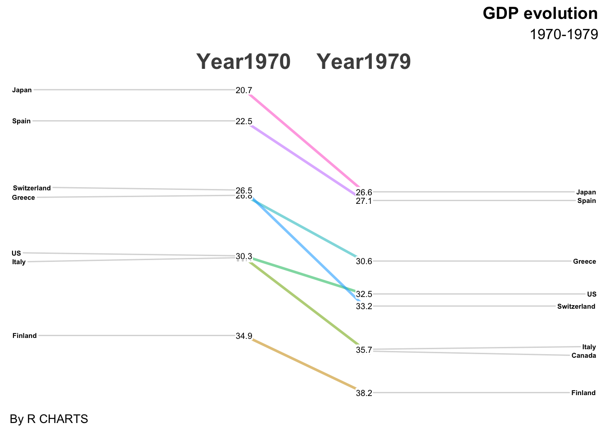
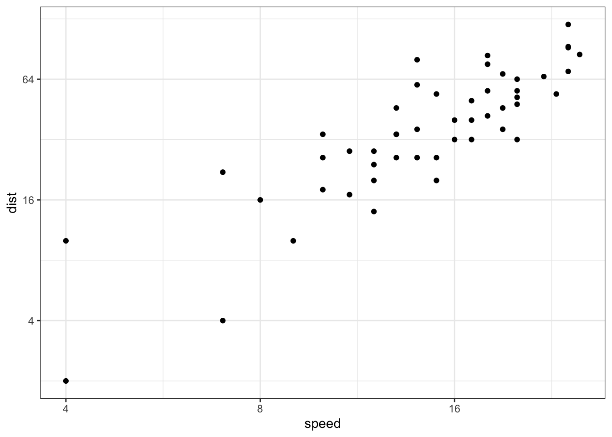
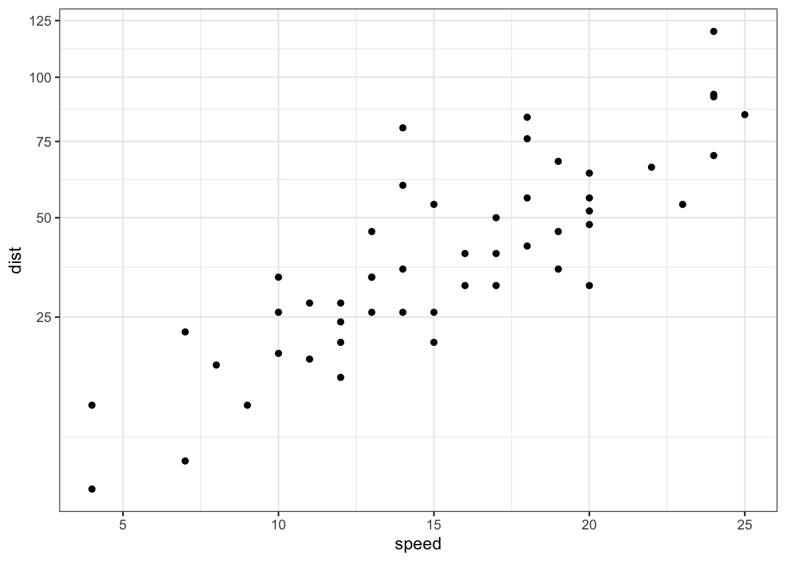
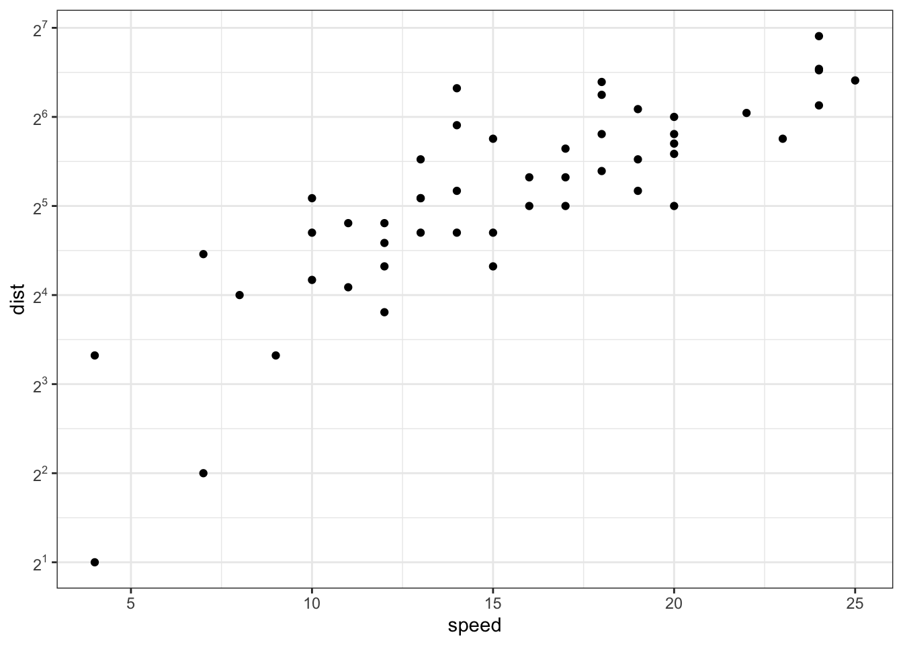
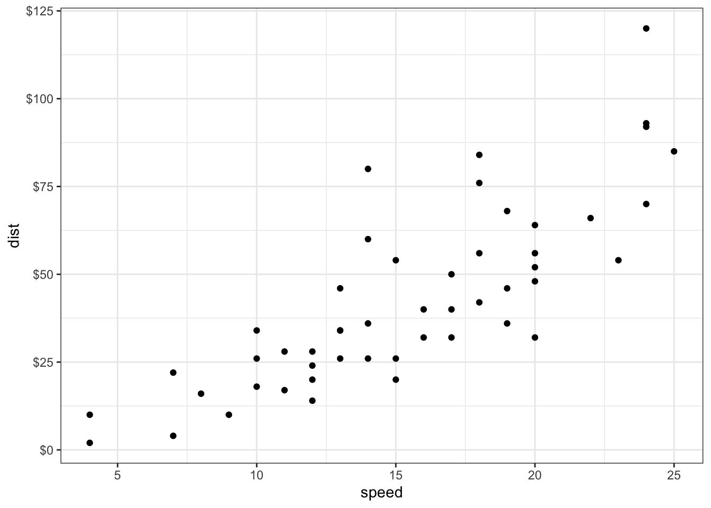
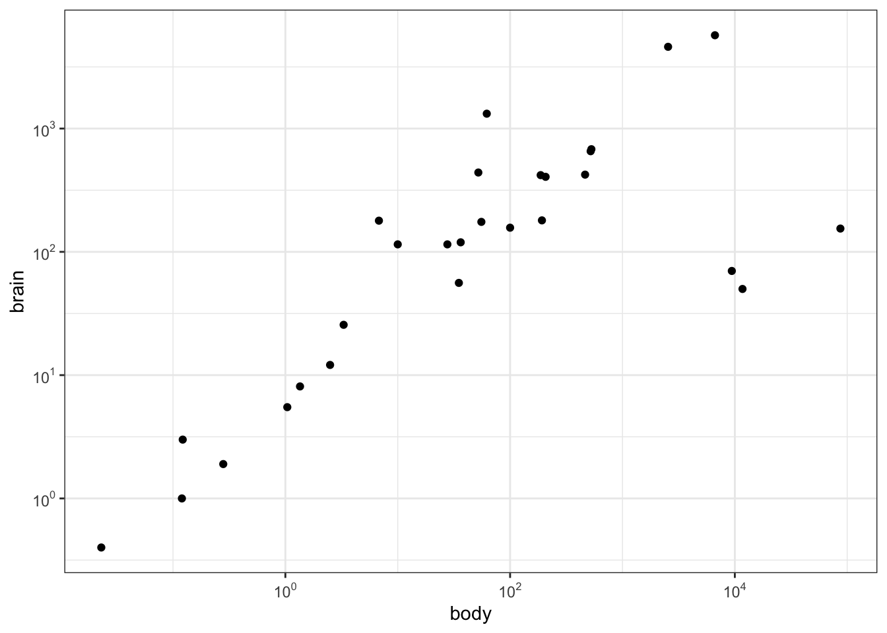
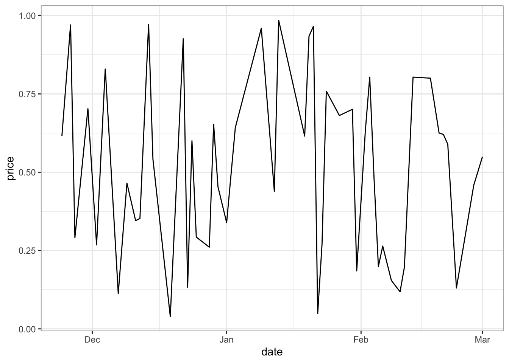
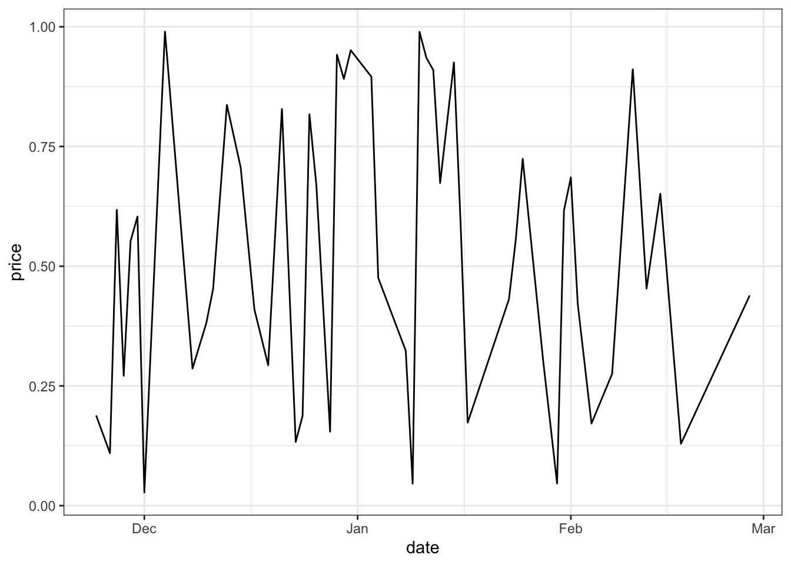

# R绘图 {#plot}


## 斜率图与newggslopegraph {#plot-newggslopegraph}

最近在制作分疾病别的患病率历年变化趋势时，看到有的研究采用多列排序图来展示，每列代表某年的疾病患病率排序，但不同列进行比较的时候只能看出排序变化而很难直观看出率的变化。

经过检索后发现斜率图可以满足前述需求，而[newggslopegraph](https://r-charts.com/evolution/newggslopegraph/)可以实现该需求，故记录该网页给出的代码，方便之后使用。


```r
library(CGPfunctions)
df <- newgdp[16:30, ]
newggslopegraph(df, Year, GDP, Country,
                Title = "GDP evolution",
                SubTitle = "1970-1979",
                Caption = "By R CHARTS",
                XTextSize = 18,    # Size of the times
                YTextSize = 2,     # Size of the groups
                TitleTextSize = 14,
                SubTitleTextSize = 12,
                CaptionTextSize = 10,
                TitleJustify = "right",
                SubTitleJustify = "right",
                CaptionJustify = "left",
                DataTextSize = 2.5, # Size of the data
                ReverseYAxis = TRUE,
                ReverseXAxis = FALSE) # reverse axes
```



## ggplot坐标轴刻度放缩  {#plot-axisscale}

最近在用ggplot绘图，遇到了一个需求，就是对坐标轴进行放缩并不均等地展示刻度。

经过检索后发现简书有位大佬[王诗翔](https://www.jianshu.com/p/03255dd4324d)科普了相关函数，可以实现该目的，故将该网页介绍的函数和给出的代码部分记录在此。

首先展示原图，很常规的散点图。


```r
# Convert dose column dose from a numeric to a factor variable
ToothGrowth$dose <- as.factor(ToothGrowth$dose)
library(ggplot2)
# scatter plot
sp<-ggplot(cars, aes(x = speed, y = dist)) + geom_point()
sp
```


想要改变连续轴的范围，可以使用xlim()和ylim()函数，min和max是每个轴的最小值和最大值。


```r
# scatter plots : change x and y limits
sp + xlim(0, 40)+ylim(0, 150)
```


注意，函数 expand_limits() 可以用于：快速设置在x和y轴在 (0,0) 处的截距项，改变x和y轴范围。


```r
# set the intercept of x and y axis at (0,0)
sp + expand_limits(x=0, y=0)
```


```r
# change the axis limits
sp + expand_limits(x=c(0,30), y=c(0, 150))
```


也可以使用函数scale_x_continuous()和scale_y_continuous()分别改变x和y轴的刻度范围（该函数还可以通过trans参数控制轴转换实现对数化）。


```r
# Change x and y axis labels, and limits
sp + scale_x_continuous(name="Speed of cars", limits=c(0, 30)) + 
  scale_y_continuous(name="Stopping distance", limits=c(0, 150))
```


其他实现轴转换（如对数化和开方）的内置转换函数：

- scale_x_log10(), scale_y_log10() : for log10 transformation
- scale_x_sqrt(), scale_y_sqrt() : for sqrt transformation
- scale_x_reverse(), scale_y_reverse() : to reverse coordinates
- coord_trans(x =“log10”, y=“log10”) : possible values for x and y are “log2”, “log10”, “sqrt”, …
- scale_x_continuous(trans=‘log2’), scale_y_continuous(trans=‘log2’) : another allowed value for the argument trans is ‘log10’

使用示例：


```r
# Log transformation using scale_xx()
# possible values for trans : 'log2', 'log10','sqrt'
sp + scale_x_continuous(trans='log2') +
  scale_y_continuous(trans='log2')
```



```r
# Sqrt transformation
sp + scale_y_sqrt()
```



```r
# Reverse coordinates
sp + scale_y_reverse() 
```


```r
# Possible values for x and y : "log2", "log10", "sqrt", ...
sp + coord_trans(x="log2", y="log2") 
```


格式化刻度标签，需要加载scales包：


```r
# Log2 scaling of the y axis (with visually-equal spacing)
library(scales)
```

```
## 
## Attaching package: 'scales'
```

```
## The following object is masked from 'package:purrr':
## 
##     discard
```

```
## The following object is masked from 'package:readr':
## 
##     col_factor
```

```r
sp + scale_y_continuous(trans = log2_trans())
```


```r
# show exponents
sp + scale_y_continuous(trans = log2_trans(),
    breaks = trans_breaks("log2", function(x) 2^x),
    labels = trans_format("log2", math_format(2^.x)))
```



```r
# Percent
sp + scale_y_continuous(labels = percent)
```


```r
# dollar
sp + scale_y_continuous(labels = dollar)
```



```r
# scientific
sp + scale_y_continuous(labels = scientific)
```


scales包也可以实现对数化刻度标记：


```r
library(MASS) # to access Animals data sets
```

```
## 
## Attaching package: 'MASS'
```

```
## The following object is masked from 'package:dplyr':
## 
##     select
```

```r
library(scales) # to access break formatting functions
# x and y axis are transformed and formatted
p2 <- ggplot(Animals, aes(x = body, y = brain)) + geom_point() +
     scale_x_log10(breaks = trans_breaks("log10", function(x) 10^x),
              labels = trans_format("log10", math_format(10^.x))) +
     scale_y_log10(breaks = trans_breaks("log10", function(x) 10^x),
              labels = trans_format("log10", math_format(10^.x))) +
     theme_bw()
# log-log plot without log tick marks
p2
```



```r
# Show log tick marks
p2 + annotation_logticks() 
```


设置显示的位置：


```r
# Log ticks on left and right
p2 + annotation_logticks(sides="lr")
```


```r
# All sides
p2+annotation_logticks(sides="trbl")
```


使用函数scale_x_date()和scale_y_date()实现日期轴格式化：


```r
df <- data.frame(
  date = seq(Sys.Date(), len=100, by="1 day")[sample(100, 50)],
  price = runif(50)
)
df <- df[order(df$date), ]
# Plot with date
dp <- ggplot(data=df, aes(x=date, y=price)) + geom_line()
dp
```



```r
library(scales)
# Format : month/day
dp + scale_x_date(labels = date_format("%m/%d")) +
  theme(axis.text.x = element_text(angle=45))
```


```r
# Format : Week
dp + scale_x_date(labels = date_format("%W"))
```


```r
# Months only
dp + scale_x_date(breaks = date_breaks("months"),
  labels = date_format("%b"))
```



设置日期轴范围：


```r
# Plot with dates
dp <- ggplot(data=economics, aes(x=date, y=psavert)) + geom_line()
dp
```


```r
# Axis limits c(min, max)
min <- as.Date("2002-1-1")
max <- max(economics$date)
dp+ scale_x_date(limits = c(min, max))
```

```
## Warning: Removed 414 rows containing missing values or values outside the scale range
## (`geom_line()`).
```


还可以阅读函数 scale_x_datetime()和scale_y_datetime()的说明进一步学习。

## 地理空间包的退役  {#plot-Rspatial}

参加中山大学传染病预测预警建模培训班，听赖颖斯教授讲解传染病的时空预测模型构建时，用到了很多地理空间相关的R软件包，安装时发现很多包已经无法下载，检索发现[R-spatial相关的rgdal，rgeos和maptools包都在2023年退役](https://r-spatial.org/r/2022/04/12/evolution.html)了，因为这些软件包的开发者Roger Bivand已经退休，不过在历史版本的R包资源中还是可以找到并下载这些软件包的，不知道未来会有哪些包代替它们。


